# Financial Market Big Data Pipeline


> A production-style end-to-end Big Data pipeline built for a university graduation project.
> Processes real stock market data through a complete data engineering stack.

## Architecture

```
Yahoo Finance API
        |
        v
  [Ingestion - Python/yfinance]
        |
        v
   HDFS Raw (CSV)
        |
        v
  [Spark Transform - MA7, RSI, Star Schema]
        |
        v
 HDFS Warehouse (Parquet)
        |
        v
     Snowflake DW
        |
        v
     Power BI Dashboard

Airflow DAG orchestrates the full flow daily at 10 PM (Sun-Thu)
```



## Tech Stack

| Layer | Technology |
|-------|-----------|
| Data Source | Yahoo Finance API |
| Ingestion | Python (yfinance) |
| Storage | Apache Hadoop HDFS 3.2.1 |
| Processing | Apache Spark 4.1.1 (PySpark) |
| Orchestration | Apache Airflow 2.8.1 |
| Data Warehouse | Snowflake |
| Visualization | Power BI |
| Infrastructure | Docker Desktop |

## Data Model (Star Schema)

```
DIM_STOCKS -----------\
                        \
                         > FACT_MARKET_TRADES <---- DIM_DATE
                        /
DIM_DATE   ------------/
```

## Project Structure

```
big-data-pipeline/
├── airflow/
│   └── dag.py
├── ingestion/
│   └── ingest.py
├── processing/
│   └── spark_transform.py
├── validation/
│   └── quality_checks.py
├── loading/
│   ├── load.py
│   └── load_to_snowflake.py
├── utils/
│   └── helpers.py
├── docker/
│   ├── docker-compose.yml
│   └── hadoop.env
├── docs/
│   └── architecture_diagram.svg
├── data/
│   └── .gitkeep
├── config.yaml
├── requirements.txt
├── start.bat
├── .gitignore
└── README.md
```

## Prerequisites

- Docker Desktop
- Python 3.10+
- Snowflake account (free trial)
- Power BI Desktop

## Quick Start

### 1. Clone the repository

```bash
git clone <repo-url>
cd big-data-pipeline
```

### 2. Start the cluster

```bash
docker compose -f docker/docker-compose.yml up -d
```

### 3. Access UIs

| Service | URL |
|---------|-----|
| HDFS NameNode | http://localhost:9870 |
| Spark Master | http://localhost:8080 |
| Airflow | http://localhost:8081 |

### 4. Run the pipeline manually

```powershell
python -m venv .venv
.\.venv\Scripts\Activate.ps1
python -m pip install --upgrade pip
python -m pip install -r requirements.txt

python ingestion\ingest.py
python processing\spark_transform.py
python validation\quality_checks.py
python loading\load.py
python loading\load_to_snowflake.py
```

### 5. Airflow DAG

- DAG ID: financial_market_pipeline
- Schedule: 10 PM (Sun-Thu)
- Tasks: ingest -> spark_transform -> validate -> load

## HDFS Structure

```
/data/
├── raw/       <- CSV files ingested from Yahoo Finance
└── warehouse/ <- Parquet files after Spark transform
    ├── fact_market_trades/
    ├── dim_stocks/
    └── dim_date/
```

## Snowflake Schema

```sql
CREATE TABLE IF NOT EXISTS DIM_STOCKS (
  TICKERID NUMBER,
  SYMBOL STRING,
  COMPANYNAME STRING
);

CREATE TABLE IF NOT EXISTS DIM_DATE (
  DATEID NUMBER,
  FULLDATE DATE,
  YEAR NUMBER,
  MONTH NUMBER,
  DAY NUMBER
);

CREATE TABLE IF NOT EXISTS FACT_MARKET_TRADES (
  TRADEID NUMBER,
  TICKERID NUMBER,
  DATEID NUMBER,
  OPENPRICE FLOAT,
  CLOSEPRICE FLOAT,
  VOLUME NUMBER,
  MA_7 FLOAT,
  RSI FLOAT
);
```

## Pipeline Steps

1. Ingest daily market data (AAPL, MSFT, BTC-USD) from Yahoo Finance.
2. Store raw CSV partitions in HDFS raw layer.
3. Transform with PySpark: clean data, compute MA7 + RSI, build Star Schema.
4. Write Parquet outputs to HDFS warehouse (fact + dimensions).
5. Validate data quality rules (nulls, keys, ranges, consistency).
6. Load curated tables into Snowflake for analytics.
7. Visualize insights in Power BI dashboard.

## Key Features

- Incremental ingestion with state tracking
- RSI and Moving Average feature engineering
- Star Schema dimensional modeling
- Automated daily scheduling via Airflow
- Parquet columnar storage for performance

## Screenshots

- Coming soon: Power BI dashboard snapshots

## Author

Mohamed Ebrahim — Faculty of Artificial Intelligence, Kafr El-Sheikh University (2023-2027)
